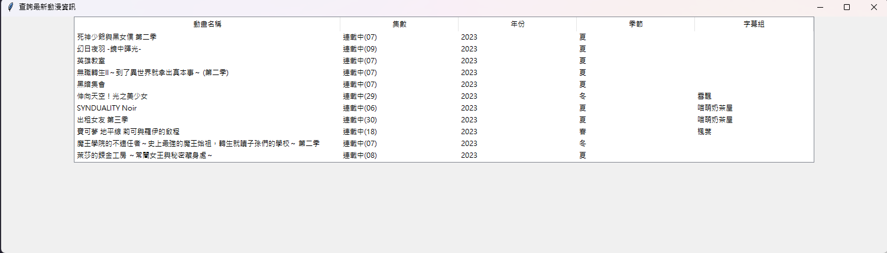
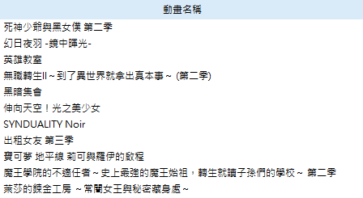
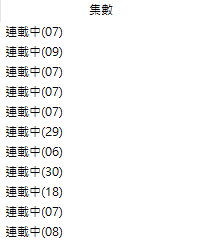
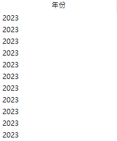

# 查詢最新動漫資訊 JSON版

這個程式是一個使用 Tkinter 創建的 GUI 工具，用於顯示和查看資料試算表格。程式會從特定網址取得 JSON 資料，然後將該資料呈現在視覺化的試算表格中。

## 功能簡介

- 顯示資料試算表格，包含 `"動畫名稱"、"集數"、"年份"、"季節"、"字幕組"` 五個欄位。
- 使用者可以在程式視窗中查看 JSON 資料的前 `11` 筆記錄。
- 資料以試算表格形式清晰地呈現，並可以根據需要進行捲動。
- 使用者可以輕鬆地查看前幾筆最新動漫資料，並且可以自由設定顯示的資料數量。

## 如何使用

1. 在終端機或命令提示字元中，執行程式檔案 `anime.py`。

2. 程式視窗將會打開，顯示一個包含 `"動畫名稱"、"集數"、"年份"、"季節"、"字幕組"` 五個欄位的試算表格。

3. 程式會自動從特定網址 `https://d1zquzjgwo9yb.cloudfront.net/?_=1691262454209` 取得 JSON 資料，並將前 11 筆記錄插入試算表格中。

4. 若要顯示更多的資料，你可以在 `load_data` 方法中調整 `range` 函式的參數，例如改成 `range(21)` 來顯示前 21 筆記錄。

    以下是相關程式碼的示例：
    ```py
    def load_data(self):
        url = "https://d1zquzjgwo9yb.cloudfront.net/?_=1691262454209"
        request = req.Request(url, headers={
            "User-Agent": "Mozilla/5.0 (Windows NT 10.0; Win64; x64) AppleWebKit/537.36 (KHTML, like Gecko) Chrome/115.0.0.0 Safari/537.36"
        })

        with req.urlopen(request) as response:
            data = response.read().decode("utf-8")

        data = json.loads(data)

        for i in range(20):  # 調整此處的數字來顯示更多記錄
            row_data = data[i][1:6]
            self.tree.insert("", "end", values=row_data)
    ```
    請根據你的需求調整 `range` 函式的參數，以顯示所需數量的資料。

## 範例演示








## 執行需求

- Python 3.x 版本
- Tkinter 庫

## 安裝步驟

1. 使用 `git clone` 命令或下載 ZIP 壓縮檔，將程式複製到你的電腦中。

2. 在命令提示字元中，進入程式所在的資料夾。

3. 執行以下指令，安裝必要的套件：
    ```
    pip install thinker
    ```

    ```
    pip install urllib3
    ```

    ```
    pip install requests
    ```

4. 執行以下指令，以執行程式：
    ```
    python anime.py
    ```

## 授權訊息

這個程式遵循 [MIT 授權](LICENSE.txt)，您可以自由地使用、修改和分享這個程式。